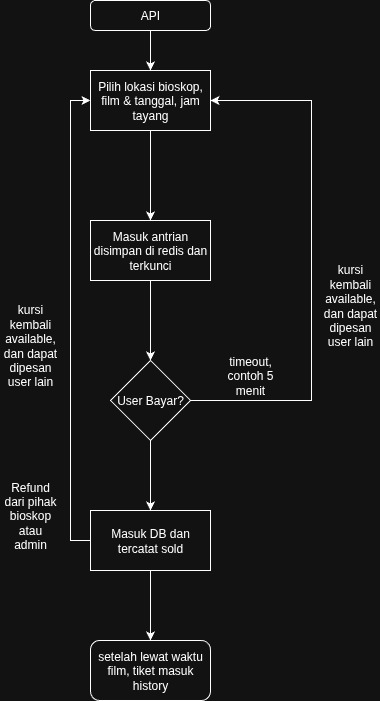

# 📘 System Design

Platform pembelian tiket bioskop online skala nasional. User dapat memesan kursi secara online dan real-time, tanpa khawatir kursinya dipakai oleh orang lain.

---

## 📊 Flowchart Sistem

---

## 💡 Penjelasan Solusi

### 1. Sistem Pemilihan Tempat Duduk

Setelah user memilih lokasi, film, dan jadwal tayang, kursi yang dipilih akan dikunci sementara di Redis selama waktu tertentu (misalnya 5 menit) agar tidak bisa diakses oleh user lain. Ini mencegah bentrok antar pemesan dalam waktu bersamaan dan meningkatkan performa sistem.

### 2. Sistem Pencatatan & Restok Tiket

Jika user menyelesaikan pembayaran tepat waktu, status kursi akan diubah menjadi “sold” dan tercatat di database. Namun jika gagal bayar atau melebihi batas waktu, kunci Redis otomatis expired dan kursi akan kembali tersedia (restok).

### 3. Alur Refund/Pembatalan oleh Bioskop

Selain itu, jika terjadi refund atau pembatalan oleh pihak bioskop (melalui admin), status tiket akan diubah menjadi “refunded” dan kursi tersebut dikembalikan menjadi available agar dapat dipesan kembali oleh user lain.

---

## ✅ Asumsi Teknis

- Data jadwal, film, dan teater disiapkan oleh admin
- Kursi spesifik per `schedule` (bukan global seat per teater)
- Redis digunakan untuk mengunci kursi sementara sebelum pembayaran
- Proses pemilihan kursi dilakukan secara atomic agar tidak terjadi race condition
- Status kursi dikelola secara eksplisit: `available`, `locked`, `sold`, `refunded`
